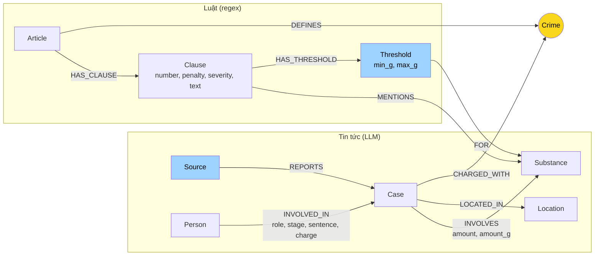

# Thiết kế Ontology: Day 19

**Họ tên:** Bùi Phương Duy  **MSSV:** 2A202602684

**Lựa chọn** (đánh dấu một):
- [ ] Dùng ontology gợi ý (có thể chỉnh nhỏ)
- [x] Tự thiết kế (xét bonus +15, xem `SUBMISSION.md`)

Ontology v2 giữ `Crime` làm cầu nối như gợi ý nhưng thêm 2 label (`Threshold`, `Source`), 3 quan hệ (`HAS_THRESHOLD`, `FOR`, `REPORTS`) và 4 property mới (`Clause.severity`, `INVOLVES.amount_g`, `INVOLVED_IN.stage`, khóa `Case.id`), mỗi thứ nhắm vào một lỗi tìm thấy ở graph gợi ý (mục 7). Số liệu lấy từ graph sau `python bench_kg.py --judge`: 317 node / 749 cạnh.

## 1. Sơ đồ

Màu vàng là node cầu nối chính (`Crime`). Màu xanh là phần thêm so với gợi ý. `Substance` là cầu phụ: nối `INVOLVES.amount_g` của vụ án với `Threshold.min_g/max_g` của khoản luật.

## 2. Entity types (node labels)

| Label | Ý nghĩa | Khóa định danh (`MERGE` theo) | Properties | Lấy từ KB nào | Trích bằng |
| --- | --- | --- | --- | --- | --- |
| `Article` | Một Điều luật (18) | `id` ("Điều 251 BLHS") | title, law, doc_id | Luật | regex |
| `Clause` | Một khoản (99) | `id` ("Điều 251 BLHS khoản 1") | number, penalty, text, severity, doc_id | Luật | regex; `severity` tính bằng `penalty_severity` |
| `Threshold` | Ngưỡng khối lượng của một điểm trong khoản (99) | `id` ("Điều 250 BLHS khoản 4 điểm b") | point, min_g, max_g, text, doc_id | Luật | regex (`parse_thresholds`) |
| `Crime` | Tội danh chuẩn hóa (13) | `name` | name | Luật (tiêu đề Điều), Tin (qua `link_entity`) | regex + `link_entity` |
| `Case` | Một vụ việc trong một bài báo (17) | `id` = `doc_id#số thứ tự` | name, summary, date, doc_id | Tin | LLM |
| `Source` | Một bài báo (15) | `doc_id` | title, url | Tin | metadata của bài, không cần LLM |
| `Person` | Người trong vụ án (36) | `name` | aliases (gộp qua các bài) | Tin | LLM |
| `Location` | Tỉnh/thành phố (8) | `name` | name | Tin | LLM |
| `Substance` | Chất ma túy, chỉ tên chuẩn (12) | `name` | name | Cả hai | `find_substances` (luật); LLM + `canonical_substance` (tin) |

Tên chất chuẩn: `SUBSTANCES` của gợi ý, thêm `Etomidate` và `chất ma túy khác` (đúng cách luật gọi nhóm còn lại: "Các chất ma túy khác ở thể rắn…").

## 3. Relationships

| Type | Từ → Đến | Properties trên cạnh | Ý nghĩa |
| --- | --- | --- | --- |
| `HAS_CLAUSE` | Article → Clause | | Điều gồm khoản nào (99) |
| `MENTIONS` | Clause → Substance | | Khoản nhắc chất nào, dùng làm phương án dự phòng khi vụ án không có số lượng (169) |
| `HAS_THRESHOLD` | Clause → Threshold | | Khoản có điểm ngưỡng khối lượng nào (99) |
| `FOR` | Threshold → Substance | | Ngưỡng áp dụng cho chất nào (240) |
| `DEFINES` | Article → Crime | | Điều định nghĩa tội nào (13) |
| `CHARGED_WITH` | Case → Crime | | Vụ bị truy tố tội nào (21). Cạnh cầu nối |
| `INVOLVES` | Case → Substance | amount (chuỗi như bài viết), amount_g (số, gam) | Vụ có chất gì, bao nhiêu (29; 11 cạnh có `amount_g`) |
| `LOCATED_IN` | Case → Location | | Nơi xảy ra vụ (16) |
| `REPORTS` | Source → Case | | Bài báo nào đưa vụ nào (17) |
| `INVOLVED_IN` | Person → Case | role, stage, sentence, charge | Vai trò, giai đoạn tố tụng, mức án, tội riêng của người đó (46) |

`stage` nhận một trong: bắt giữ, khởi tố, truy tố, xét xử sơ thẩm, xét xử phúc thẩm, không rõ. Trong graph hiện tại: bắt giữ 18, xét xử sơ thẩm 15, khởi tố 8, không rõ 5.

## 4. Node cầu nối giữa 2 KB

- **Node nào:** `Crime` (cầu chính). `Substance` là cầu phụ để chọn khoản theo số lượng.
- **Vì sao chọn node này:** báo viết tên tội, không viết số Điều; luật định nghĩa tội qua tiêu đề Điều. `Crime` là thứ duy nhất xuất hiện nguyên vẹn ở cả hai phía. `Substance` thêm vào vì khoản luật được chọn theo chất và khối lượng, nên hai phía còn phải gặp nhau ở chất.
- **Cách đảm bảo hai phía khớp tên:**
  - Tội danh: danh sách tên chuẩn lấy từ tiêu đề Điều đưa vào prompt, kết quả LLM đi qua `link_entity` (chuẩn hóa, khớp chính xác, rồi `difflib` cutoff 0,8).
  - Chất: danh sách chuẩn trong prompt, rồi `canonical_substance` (bảng đồng nghĩa như thuốc lắc → MDMA, ma túy đá → Methamphetamine, "ma túy" chung chung → `chất ma túy khác`, sau đó `link_entity` chữ thường).
- **Khi nào cầu gãy, và xử lý thế nào:**
  - Tội danh không có trong 18 Điều đã nạp: `link_entity` trả `None`, không tạo cạnh `CHARGED_WITH` (cố ý: nối sai tệ hơn không nối). Hiện còn đúng 1 `Case` chưa nối (`MATCH (k:Case) WHERE NOT (k)-[:CHARGED_WITH]->() RETURN count(k)` → 1 trên 17).
  - Vụ án có nhiều tội cho nhiều người (vụ Hoàng Nato có cả tàng trữ, mua bán, tổ chức sử dụng): cầu nối ở mức `Case` quá rộng. `context()` thu hẹp bằng `INVOLVED_IN.charge` của người được nêu trong câu hỏi.
  - Vụ án không có số lượng (`amount_g` rỗng, hiện 18 trên 29 cạnh `INVOLVES`): rơi về `MENTIONS`, như gợi ý.

## 5. Competency questions

| Câu | Đường đi (Cypher pattern) | Trả lời được? |
| --- | --- | --- |
| Q1 (tiền chất là gì) | `(:Article {id:'Điều 2 Luật PCMT'})-[:HAS_CLAUSE]->(:Clause {number:4})`, đọc `text` | Có, chỉ KB luật. Graph không thêm giá trị so với vector search (cả hai recall 1,00) |
| Q2 (bị cáo nào tử hình) | `(:Person)-[:INVOLVED_IN {sentence}]->(:Case {name ~ '36kg'})`, lọc `sentence` | Có, chỉ KB tin |
| Q3 (Lê Minh Thành: án, tội, Điều, khung) | `(:Person {name:'Lê Minh Thành'})-[:INVOLVED_IN {sentence}]->(:Case)-[:CHARGED_WITH]->(:Crime)<-[:DEFINES]-(:Article)-[:HAS_CLAUSE]->(:Clause {number:1, penalty})` | Có (Graph 1,00, Flat 0,00) |
| Q4 (Hoàng Nato: hành vi, phạt tối đa) | `(:Person {aliases ∋ 'Hoàng Nato'})-[r:INVOLVED_IN]->(:Case)-[:CHARGED_WITH]->(c:Crime {name: r.charge})<-[:DEFINES]-(:Article)-[:HAS_CLAUSE]->(cl:Clause)`, `ORDER BY cl.severity DESC LIMIT 1` | Có (v2); gợi ý trả lời sai "tối đa 7 năm". Graph 1,00 / judge 2 |
| Q5 (Cái Quang Huy: tội, chất, khoản, khung) | `(:Case)-[r:INVOLVES]->(s:Substance {name:'MDMA'})<-[:FOR]-(t:Threshold)<-[:HAS_THRESHOLD]-(cl:Clause)` với `t.min_g <= r.amount_g < t.max_g` (hoặc `max_g` rỗng) trong Điều mà `Case` bị `CHARGED_WITH` | Có. 9.600 g ≥ 100 g → Điều 250 khoản 4 |
| Q6 (vụ nào liên quan MDMA) | `(:Case)-[:INVOLVES]->(:Substance {name:'MDMA'})`, kèm `(:Person)-[:INVOLVED_IN]->(:Case)` | Có, một bước. Graph recall 1,00 (gợi ý 0,00) |

## 6. Quyết định thiết kế và đánh đổi

1. `Crime` làm cầu nối chính, không nối thẳng `Case` → `Article`. Phương án khác: `CHARGED_WITH` trỏ thẳng tới `Article`. Chọn `Crime` vì báo viết tên tội; việc chuyển tên tội thành Điều tách riêng thì `link_entity` chỉ phải giải bài toán khớp tên.
2. Tách tới mức `Clause` và `Threshold` (điểm), không dừng ở `Article`. Phương án khác: một node `Article` chứa toàn bộ text. Khung hình phạt phụ thuộc khoản, và khoản phụ thuộc chất cùng khối lượng. Đánh đổi: 99 `Threshold` và 240 cạnh `FOR` làm graph to hơn (317 node so với 207), nhưng prompt lại ngắn hơn vì chỉ lấy đúng khoản.
3. Luật trích bằng regex, tin trích bằng LLM. Phương án khác: LLM cho cả hai. Luật đều nên regex cho cùng kết quả mỗi lần và không tốn token; tin là văn xuôi nên cần LLM. Prompt v2 dài hơn (thêm `amount_g`, `stage`), nên chi phí dựng graph tăng nhẹ: 5.851 token ra so với 4.763.
4. Con số là property số, không là chuỗi. `amount_g` (gam) cạnh `amount` (nguyên văn), `min_g/max_g` trên `Threshold`, `severity` trên `Clause`. Phương án khác: giữ chuỗi như gợi ý và để LLM so sánh khi trả lời. So sánh bằng Cypher thì cùng kết quả mỗi lần chạy và không phụ thuộc LLM tính nhẩm 9,6 kg so với 100 g. Đánh đổi: LLM phải quy đổi sang gam khi trích; hiện chỉ 11 trên 29 cạnh `INVOLVES` có `amount_g`.

## 7. So với ontology gợi ý (bắt buộc nếu xét bonus)

Kết quả của gợi ý nằm ở `ket_qua_benchmark_kg.hint.txt`, của ontology này ở `ket_qua_benchmark_kg.txt` (cùng model `gpt-4o-mini`, cùng chunking, 1 lần chạy mỗi bên).

| Điểm khác | Gợi ý làm gì | Bạn làm gì | Vấn đề nó giải quyết | Bằng chứng |
| --- | --- | --- | --- | --- |
| `Clause.severity` (điểm nặng của khung: tử hình 1000, chung thân 100, hoặc số năm tù) | Không có. `context()` chỉ giữ khoản 1 và khoản nhắc chất của vụ | Mỗi khoản có `severity` số; khi câu hỏi hỏi "tối đa" thì lấy khoản `ORDER BY severity DESC LIMIT 1` | Q4 hỏi mức phạt tối đa; khung nặng nhất nằm ở khoản 4, không bao giờ vào prompt | Hint Q4: *"…phạt tù tối đa 7 năm theo Điều 255 BLHS khoản 1"*, recall 0,67, judge 1. V2 Q4: *"…tối đa 20 năm hoặc tù chung thân theo Điều 255…"*, recall 1,00, judge 2. Cypher: `MATCH (a:Article {id:'Điều 255 BLHS'})-[:HAS_CLAUSE]->(c) RETURN c.number, c.severity ORDER BY c.severity DESC LIMIT 1` → khoản 4, `severity` 100 |
| `Threshold` + `INVOLVES.amount_g` (ngưỡng khối lượng thành node, khối lượng của vụ thành số gam) | Khoản chỉ `MENTIONS` chất; `amount` là chuỗi tự do ("9.6kg", "khoảng 100g", "không rõ") nên không so được với "100 gam trở lên" | Trích ngưỡng từ từng điểm bằng regex; trích `amount_g` bằng LLM; chọn khoản bằng so sánh số trong Cypher | Khoản được chọn vì khối lượng phù hợp, không phải vì chỉ nhắc tới chất. Đây là ngưỡng khối lượng mà gợi ý ghi là chưa mô hình hóa | Cypher: `MATCH (k:Case)-[r:INVOLVES]->(:Substance {name:'MDMA'})<-[:FOR]-(t:Threshold)<-[:HAS_THRESHOLD]-(cl:Clause) WHERE r.amount_g >= t.min_g AND (t.max_g IS NULL OR r.amount_g < t.max_g) RETURN k.name, r.amount_g, cl.id` → vụ Cái Quang Huy (9.600 g) khớp `Điều 250 BLHS khoản 4`. V2 Q5: *"khoản 4 của Điều 250 BLHS"*, recall 1,00, judge 2 (Flat: "khoản b", recall 0,60). Lưu ý: hint Q5 cũng đạt 1,00, nên đây là cải thiện về độ chắc chắn, không phải về điểm |
| Tên chất chuẩn (`canonical_substance`, thêm `chất ma túy khác`) | `Substance` khóa theo tên LLM trả về, không gộp đồng nghĩa | Bảng đồng nghĩa + `link_entity` chữ thường; nhóm chung chung về `chất ma túy khác`, khớp với cách luật gọi | Một chất thành nhiều node, làm câu hỏi theo chất (Q6) bị sót | Hint: `MATCH (s:Substance) RETURN s.name` ra 17 tên gồm `Ketamine`/`ketamine`, `Methamphetamine`/`methamphetamine`, `ma túy`, `chất ma túy`, `ma túy tổng hợp`, `thuốc lắc`. V2: 12 tên, không trùng. Q6 recall 0,00 → 1,00 (đủ Cái Quang Huy, Lê Minh Thành, Pháp y tâm thần) |
| `Source` + khóa `Case.id` = `doc_id#số thứ tự` | `Case` khóa theo `name` do LLM đặt, `SET k.doc_id` ghi đè bài sau lên bài trước | Mỗi vụ có khóa ổn định theo bài; `(:Source)-[:REPORTS]->(:Case)` cho biết bài nào đưa vụ nào | Hai vụ khác nhau trùng tên thì bị gộp; không truy ngược được vụ về bài | Hint: 14 `Case` / 20 bài, bốn `Case` khác tên cho cùng người Dương Minh Tuấn. V2: 17 `Case` từ 15 `Source` (`MATCH (s:Source)-[:REPORTS]->(k:Case)`), 2 bài có 2 vụ. Số `Case` khác nhau còn do LLM chạy lại, nên tôi không kết luận "gộp nhầm" từ con số này |
| `INVOLVED_IN.stage` (giai đoạn tố tụng) | Mọi giai đoạn gộp chung | Thêm `stage` trên cạnh `Person → Case` | `sentence` chỉ có nghĩa ở giai đoạn xét xử; người bị bắt chưa có án | `MATCH ()-[r:INVOLVED_IN]->() RETURN r.stage, count(*)` → bắt giữ 18, xét xử sơ thẩm 15, khởi tố 8, không rõ 5. Chưa dùng trong `context()` nên chưa cải thiện benchmark |
| `aliases` gộp, không ghi đè | `SET person.aliases = …` ghi đè bài sau lên bài trước | Hợp (union) alias qua các bài | Mất biệt danh khi một người xuất hiện ở nhiều bài; câu hỏi gọi người bằng biệt danh ("Hoàng Nato") không tìm được node | `MATCH (p:Person) WHERE size(p.aliases) > 1 RETURN p.name, p.aliases` → Phan Kim Nhi có `['Phannhibeauty', 'TikToker Phannhibeauty']` |

Kết quả benchmark (trung bình mỗi câu hỏi, Graph):

| Chỉ số | Gợi ý | Ontology này |
| --- | --- | --- |
| recall | 0,78 | 1,00 |
| judge | 1,67 | 1,83 |
| token vào / câu | 4.716 | 3.368 |
| USD / câu | 0,00075 | 0,00055 |
| Dựng graph: node / cạnh | 207 / 384 | 317 / 749 |
| Dựng graph: USD / giây | 0,00936 / 153,5 | 0,01046 / 107,0 |

Ngoài ontology, `context()` có hai thay đổi cùng lúc với ontology, nên phần cải thiện không hoàn toàn do ontology: (a) bỏ các cạnh cấu trúc `HAS_CLAUSE`/`MENTIONS` khỏi dữ kiện seed vì chúng chiếm hết 60 cạnh và đẩy Điều 255 ra khỏi prompt (token vào giảm 4.716 → 3.368); (b) khi câu hỏi nêu tên một người, chỉ đi theo tội riêng của người đó (`INVOLVED_IN.charge`). Q4 chỉ đạt 1,00 sau khi có cả severity lẫn (a) và (b): bản có severity nhưng chưa có (a) cho recall 0,33 và 0,00 ở hai lần chạy.

## 8. Hạn chế còn lại

- Chỉ một lần chạy mỗi bên. LLM trích xuất không xác định: cùng ontology v2 nhưng trước khi sửa `context()`, hai lần chạy cho recall 0,89 và 0,83. Chênh lệch giữa 0,78 và 1,00 chưa phải là ước lượng có khoảng tin cậy.
- `amount_g` thiếu nhiều: 11 trên 29 cạnh `INVOLVES`. Vụ không có số lượng chỉ chọn khoản bằng `MENTIONS` như gợi ý.
- Ngưỡng thể lỏng và "tổng khối lượng nhiều chất" chưa mô hình hóa: regex chỉ lấy gam/kilôgam, bỏ mililít và điểm "02 chất ma túy trở lên".
- Khớp ngưỡng theo từng Điều: `Threshold` được tạo cho cả 5 Điều (từ Điều 248 đến Điều 252). Truy vấn không giới hạn Điều (như ví dụ MDMA trong mục 7) ra cả 5 Điều; chỉ khi đi qua `CHARGED_WITH` mới đúng Điều.
- `Case` vẫn không gộp được xuyên bài: bốn bài về Hoàng Nato cho bốn `Case` riêng. Ổn định theo bài nhưng chưa nhận ra "cùng một sự việc".
- `stage` chưa được dùng khi trả lời, chỉ để đó.
- Phép đo (Q6): judge cho Flat 1 ở lần chạy gợi ý và 2 ở lần này với câu trả lời gần như giống hệt (và sai: liệt kê "Đức", "Thành", "Đông" thay cho tên vụ), trong khi recall luôn 0,00. Judge của chính LLM dao động, cần đọc câu trả lời thay vì tin điểm tổng hợp (E4).
